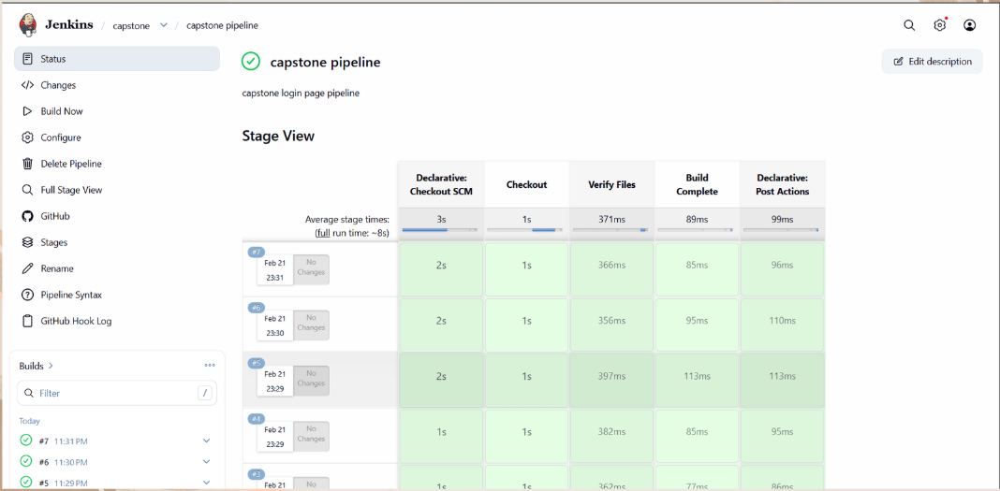

# 🚀 AI-Powered Intrusion Detection System for SDN

An **AI-powered Intrusion Detection System (IDS) for Software Defined Networks (SDN)** designed to monitor network traffic and detect malicious activity using **machine learning techniques**.

This project also demonstrates **DevOps practices** including **Docker containerization and Jenkins CI/CD automation**. The system is designed to support real-time monitoring and automated deployment workflows.

---

# 📌 Project Overview

Modern networks face increasing cybersecurity threats. Traditional monitoring tools often struggle to detect sophisticated attacks.

This project aims to build a **machine learning-based IDS integrated with SDN architecture** to:

* Monitor network traffic in real time
* Detect abnormal network behavior
* Classify malicious network traffic
* Provide an administrative monitoring interface
* Automate build and deployment using DevOps tools

---

# 🧠 AI-Based IDS for SDN

The system integrates **Machine Learning based intrusion detection** with **Software Defined Networking (SDN)**.

### Key Capabilities

* Real-time network traffic monitoring
* Machine learning based attack detection
* Traffic classification (Normal / Malicious)
* Network flow analysis
* Alert and event logging
* Administrative monitoring dashboard (under development)

Potential attack detections include:

* DDoS attacks
* abnormal traffic flows
* malicious packets
* suspicious network behavior

---

# 🏗 System Architecture

User / Administrator
│
▼
React Dashboard (Monitoring Interface – In Development)
│
▼
Node.js Backend API
│
▼
AI / ML Intrusion Detection Model
│
▼
Database (MongoDB / PostgreSQL)
│
▼
Docker Containers
│
▼
Jenkins CI/CD Pipeline

---

# ⚙️ Technology Stack

## Frontend

* React.js
* Tailwind CSS
* JavaScript
* HTML5

## Backend

* Node.js
* Express.js
* REST APIs

## Database

* MongoDB
* PostgreSQL

## DevOps

* Docker
* Docker Compose
* Jenkins CI/CD

## Security

* JWT Authentication

## Machine Learning

* AI-based network traffic classification model

---

# 🔐 Key Features

## JWT Authentication

Secure authentication system using **JSON Web Tokens (JWT)**.

Features:

* Protected API routes
* Secure user authentication
* Token-based authorization

---

## Database Integration

The system stores important operational data including:

* user authentication data
* network traffic logs
* IDS detection results
* security alerts
* system activity records

Supported databases:

* MongoDB
* PostgreSQL

---

## 📊 IDS Monitoring Dashboard

A monitoring dashboard is being developed to provide administrators with a visual interface for:

* network traffic monitoring
* intrusion detection results
* flow statistics analysis
* alert and log monitoring

⚠️ The dashboard interface is currently **under development**.

---

# 📸 Project Screenshot

## Jenkins CI/CD Pipeline

The project integrates a **working Jenkins pipeline** to automate parts of the development workflow.

The pipeline performs tasks such as:

* source code checkout
* project file verification
* build checks
* automated pipeline execution

---

# 📂 Project Structure

AI-Powered-Intrusion-Detection-System-for-SDN

backend
├── config
├── controllers
├── models
├── routes
├── server.js
├── Dockerfile
└── package.json

frontend
├── public
├── src
├── Dockerfile
├── tailwind.config.js
└── package.json

docker-compose.yml
Jenkinsfile
jenkins-docker
README.md

---

# ⚙️ Backend Setup

Before running the backend server, install the required dependencies.

Navigate to the backend directory:

cd backend

Install dependencies:

npm install

This command automatically creates the **node_modules folder** and installs all packages listed in `package.json`.

---

# 📦 Installing Express

If Express is not installed, install it using:

npm install express

After installation, the backend directory will include:

backend
├── config
├── controllers
├── models
├── routes
├── node_modules
├── package.json
├── package-lock.json
└── server.js

The **node_modules directory contains all backend dependencies required to run the application**.

---

# ▶ Running the Backend Server

Start the backend server using:

node server.js

Or with nodemon:

npx nodemon server.js

---

# 🐳 Running the Project with Docker

Clone the repository:

git clone https://github.com/Satya-Anand/AI-Powered-Intrusion-Detection-System-for-SDN.git

Navigate into the project directory:

cd AI-Powered-Intrusion-Detection-System-for-SDN

Run the containers:

docker-compose up --build

This will start:

* frontend container
* backend container
* database services

---

# 🔄 Jenkins CI/CD Pipeline

The Jenkins pipeline automates development tasks including:

1. Source code checkout
2. Build verification
3. Pipeline execution
4. Build status reporting

Pipeline configuration is defined in:

Jenkinsfile

---

# 🚧 Future Improvements

Planned enhancements include:

* advanced ML model training
* cloud deployment (AWS / GCP)
* automated threat mitigation
* network visualization tools
* IDS performance metrics
* enhanced security controls

---

# 👨‍💻 Author

**Satya Pragy Anand**

B.Tech Computer Science
NIIT University

Interests:

* Cybersecurity
* DevOps
* AI Security
* Data Analytics

---

# ⭐ Support

If you find this project useful:

⭐ Star the repository
🍴 Fork the repository
📩 Share feedback or suggestions

---

# 📜 License

This project is created for **academic and research purposes**.
